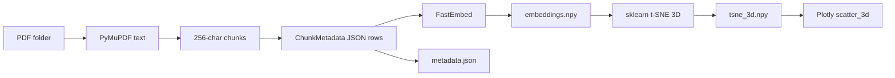

# Architecture

This document summarizes how the pipeline is split into composable pieces and how data flows through them.

## End-to-end flow

## Module map

| Module | Responsibility |
|--------|------------------|
| `pdf_io.py` | List `.pdf` paths in a directory; extract plain text per file |
| `chunking.py` | Split text into fixed-size character chunks |
| `corpus.py` | Combine discovery + extraction + chunking into `ChunkMetadata` rows |
| `embedding.py` | Dense embeddings; tiktoken token counts for debugging/metadata |
| `storage.py` | Load/save `embeddings.npy`, `metadata.json`, `tsne_3d.npy` |
| `tsne_step.py` | 3D t-SNE projection with sensible perplexity defaults |
| `visualization.py` | Plotly figures: combined trace, or **one trace per filename** |
| `controller.py` | `PdfEmbeddingAnalysis` orchestrates cache + steps + plotting API |
| `types.py` | `ChunkMetadata`, storage path bundle |

## Controller vs building blocks

Use **`PdfEmbeddingAnalysis`** when you want caching, a single entry point, and notebook-friendly accessors (`embeddings`, `tsne_3d`, `metadata`, plot methods).

Import individual functions when you want custom orchestration (e.g. different vector store, different chunking, partial reruns).

## PDF discovery scope

`list_pdf_paths` considers only **files directly inside** the given folder (not subdirectories). If you need recursive discovery, extend `pdf_io.list_pdf_paths` or preprocess files into a flat folder.

## Embedding model

Default: **FastEmbed** with `BAAI/bge-small-en-v1.5` (384 dimensions). Swap models by passing a custom `embedder` to `PdfEmbeddingAnalysis` that satisfies the `EmbeddingModel` protocol in `embedding.py`.
